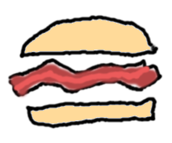
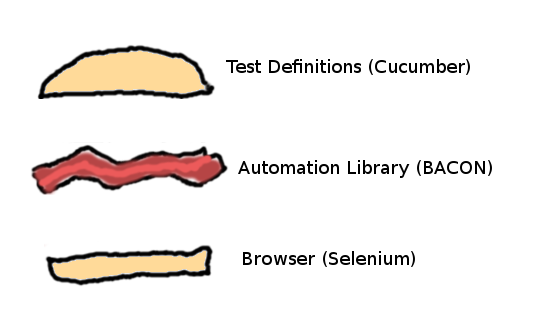
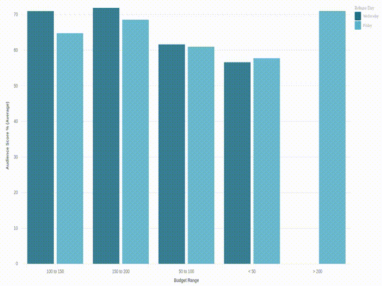
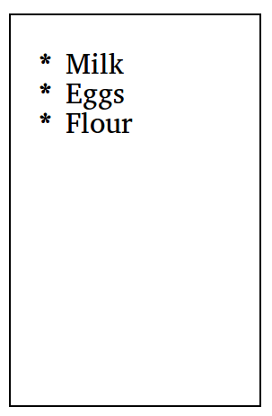
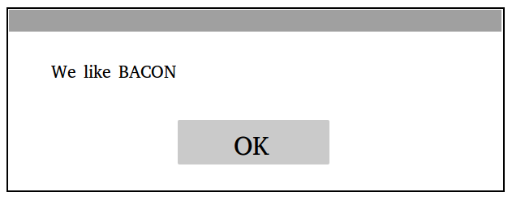

# BACON - The *B*rowser *A*utomation *Co*okbook

<p align="center">
    </img>
</p>

**BACON is the about the meat between your test definitions and browser that makes everything better**

* A design pattern to deal with heavily **dynamic** pages
* Respect best coding practices like **DRY**, **KISS** and **SOLID**, to keep your automation code maintainable

---

# 1. Introduction

Automating a web application user interface consists of three areas:

<p align="center">
    </img>
</p>

* **Test Definitions** describe what scenario to execute and what to validate.
    * How you will define the tests will depend on the test framework you choose. BACON is not tied to a  specific framework, nor will it tell you how to test. Our team though, favors *Cucumber*.
* Your own **Automation Library**. This is what this cookbook is all about, on how to organize your automation code.
* **Browser** (-driver) is the generic browser automation part, which is not specific to the application, the industry standard is to use *Selenium WebDriver*.

BACON describes how you organize your automation code in a way it is maintainable, yet very flexible.
It is born out of necessity for testing heavily dynamic web applications and has proven its value in both Java and JavaScript frameworks.
The reasons our pattern and practices work with dynamic pages can be summarized to:

* We don't ask the browser for an element until we actually need to use it.
* We poll/wait instead of asserting.

**An example of a dynamic page, where other approaches would fail:**
Consider the following (svg) visualization changing from a bar chart to an area chart and we want to verify a certain data point exist in the area chart. The entire DOM might re-render and the change is done asynchronously, we do not know when the change happens exactly. We might not even know when the chart finished rendering, which makes it even harder to synchronize the UI with our tests.
<p align="center">
    </img>
</p>

If we would keep a reference to the element that represents the visualization instead of looking it up when we need it, it's hard to ensure our reference is the actual area chart and not the (stale) bar chart. If the first reference is the old bar chart, any assertion on the data point would fail. But, since we keep polling, the reference would eventually become the reference to the area chart and the assertion will pass.


---

# 2. The Pattern

Our pattern is an extension to [Page Objects](https://martinfowler.com/bliki/PageObject.html).
The principle is the same: we name everything that the user sees and can interact with, a `Fragment` (instead of a `PageObject`) <sub>(even though PageObject is probably a better name)</sub>.
Examples are buttons, dialogs, visualizations, labels, form elements.

A `Fragment` has two responsibilities:
* Contain a definition of how to find the element
* Expose actions that are relevant

Your Automation Library will mostly consist of `Fragments`, which together represent your application. Each `Fragment` has certain operations it can do, which can be an action, like clicking, but also be verification, like verifying its text.

## Defining Fragments

The key to working with dynamic pages is that a `Fragment` can be initialized without the actual element(s) to be available on the page.
A `Fragment` holds all the information that is necessary to find it. We call this information the `SearchCriteria`.
The `SearchCriteria` consist of least a selector (e.g. CSS or XPath selector), but can be narrowed down with, for example, a text matcher or index.

Therefore, a `Fragment` can represent either one element, but also a group of similar elements.

For example, if our web page has a shopping list:

<p align="center">
    </img>
</p>

with the following HTML:
```html
<ul class="shoppingList">
  <li>Milk</li>
  <li>Eggs</li>
  <li>Flour</li>
</ul>
```

A `Fragment` identified with the css selector `.shoppingList li` represents all three items on the list.
When you narrow it down with `SearchCriteria`, it will result in a new `Fragment`. It does not change the original `Fragment`.

```java
Fragment shoppingItems = new Fragment( webDriver, By.cssSelector( ".shoppingList li" ) );
Fragment firstItem = shoppingItems.withIndex(0);
// Note: just defining the fragment doesn't make verify anything, if we want to verify it exists,
// we can call a verification method, for example .verifyPresent():
firstItem.verifyPresent();
// Or verify the text of the first item is "Milk":
firstItem.withText("Milk").verifyPresent();
// Narrowing down didn't change the original fragment:
shoppingItems.verifySize(3);
```

## Fragment Containers

A `Fragment` may contain other `Fragments`. For example, if we look at a dialog:

<p align="center">
    </img>
</p>

We can define the following fragments:

* `Dialog`
* `OKButton`, which is a child of `Dialog`
* `Description`, which is a child of `Dialog`

A `Fragment` should only expose actions that are relevant:

```java
// Java
// Precondition: we have a WebDriver instance named `driver`.
Dialog dialog = new Dialog( driver );

// These actions might be useful to expose:
dialog.verifyPresent();
dialog.description.verifyPresent();
dialog.description.verifyText( "We like BACON" );
dialog.okButton.verifyPresent();
dialog.okButton.click();

// But we probably have no reason for exposing:
dialog.description.click();
```

In Java, we could use wrap our `Fragment`:
```java
// Java
public class Dialog extends Fragment {
  public IButton oKButton    = new Button( child( By.cssSelector( ".okButton" ) ) );
  public IText   description = new Text(   child( By.cssSelector( ".description" ) ) );

  public Dialog( WebDriver driver ) {
    super(driver, By.cssSelector(".dialog"));
  }
}
```

In more dynamic languages, such as JavaScript, we can decorate the `Fragment` with additional functionality more directly:

```js
// JavaScript
function Dialog( driver ) {
    Fragment.call( this, driver, ".dialog" );

    this.okButton    = this.child( ".okButton",    [Button] );
    this.description = this.child( ".description", [Text] );
}
```

This is a bit more powerful as it allows you to define a clickable text as well without having to define a new interface. In practice, it will also be easier to keep your base `Fragment` implementation clean.

In both approaches, you see two different ways of defining a Fragment: either by subclassing a `Fragment` or instantiating one.
We usually instantiate one if it is very specific and we define a subclass if it tends to show up on in different parts of our application or if it makes sense conceptually.


## Encapsulating Fragments

In some cases, it makes sense to hide a child `Fragment`. Our dialog, we could define as:

```java
// Java
public class Dialog extends Fragment {
  private IButton oKButton = new Button( child( By.cssSelector( ".okButton" ) ) );

  public Dialog( WebDriver driver ) {
    super(driver, By.cssSelector(".dialog"));
  }

  public void dismiss() {
    okButton.click();
  }
}

// So instead of:
new Dialog( driver ).okButton.click();
// We use this, which can in some cases increase readability:
new Dialog( driver ).dismiss();
```


## Implementing the Fragment base class

Now you have an understanding of what `Fragment` does, its time to start thinking about the implementation.
There's some generic basic functionality it should have:

* The initialization
* Setting `SearchCriteria`
* A non-public method to find all elements that satisfy the `SearchCriteria`, with variations
    * that returns directly, even when no elements found (typically used when verifying something is not there)
    * that will poll until at least one item is found and will trow a clear error when nothing was found.
* The method for creating of children
* Some general validation methods, like `verifyPresent`. Use polling over assertions, see Best Practices.
* Implementing `Capabilities`, for example `click` for a generic Button Fragment. How you implement this (by wrapping or decorating) will likely depend on your programming language.

---

# 3. Best Practices


## Separate Tests from Automation

Test state/context is knowledge that belongs to the test, not your automation library.
Keep the state close to your test. If you pollute your automation library with it, it likely gets unnecessarily more complex and less reusable.

Real life examples:

>*The Registry* - When our tests presses the 'save' button, we need to register it, so when our test finishes, we know what we have to clean up.
>So we built it into the code that handles the save button click. It worked nice for a while, until we had an error scenario where we wanted to verify clicking the save button did not save anything. So we moved it outside of our library again, closer to the test definition.

>*Too Much Context* - Since our automation library is used for testing, we thought we should build in a lot of validation for convenience. We noticed soon that the validation we were doing depended on the context. For example, if a certain menu was opened, the menu itself needed to know what opened it. This is typically a bad programming practice. It's more convenient to keep this knowledge of context in the tests instead of inside your automation library.
The same thing happened for a control that behaved differently in different areas of the application.

## Favor CSS over XPath Selectors
XPath expressions are harder to read (and maintain). And since web developers are familiar with CSS already, we strongly favor using CSS over XPath.

There are a few exceptions, as XPath is in fact more powerful. We say 'few', because our `SearchCriteria` eliminates most of them. And even then, those 'few' cases can be an indication your web page might need a better structure.

## Favor polling over asserting (and sleeps)
We need our test to synchronize with whats actually shown on the web page, in order to execute our test scenario correctly.
E.g. we can't click on a form, if that form hasn't loaded yet.
So we synchronize by waiting for the form to appear.

If we expect a text to change, we don't assert on the text, we wait until the text has the text it should have, with a timeout.

**Avoid sleeps at all costs.** - The time you're sleeping is either too long (inefficient) or too short (which makes your synchronization fail and causes tests to fail).

Since we poll at the very core of `Fragments`, our test suffer from less false negatives, because our timeouts are set to a time we are certain the test should have synchronized with the application. Therefore we don't need to worry about several kinds of synchronization issues, which are typically hard to analyze:

* Validating a text that just wasn't updated *yet*.
* Stale Elements - On dynamic pages, this means elements that were there, but changed/removed while doing an action on them. We simply retry if this happens.

These would normally be hard to analyze, because tests stop when they fail. If we wouldn't poll, it's hard to figure out whether the expected situation would still come or not. So in a way, the polling is comparable to waiting for the system to be *quiescent* in formal testing theories.

If you've read about Selenium's implicit vs explicit timeouts, you know that explicit timeouts give you more control. By polling, we force to use explicit timeouts (`WebDriver`'s `wait`).

Polling methods can still contain asserts, in fact, this usually improves the feedback. Just ignore failed assertions until the polling times out.
Selenium's `WebDriverWait` has built-in functionality to do this, for example, our `Fragment` method to wait for a number of elements, looks as following:

```java
// Java
public void verifySize( final int expectedSize )
{
    new WebDriverWait(driver, DEFAULT_WAIT)
        .ignoring( StaleElementReferenceException.class, AssertionError.class )
        .withMessage( "Expected to find exactly " + expectedSize + " element(s)" )
        .until( new ExpectedCondition<Boolean>()
    {
        @Override
        public Boolean apply( WebDriver webDriver )
        {
            assertThat( findAllInstantly().size(), is( expectedSize ) );
            return true;
        }
    } );
}
```

## Generate HTML reports with screenshots of failing tests
Screenshots can help a lot when analyzing failures. Make sure your test framework saves a screenshot when a test fails.
In Selenium + Cucumber, this could look like:

```java
// Java
// Hooks.java
@After
public void afterTest( final Scenario _scenario ) throws TimeoutException, Exception {
  if ( _scenario.isFailed() ) {
    final byte[] failedScreenshot = DriverRunner.getScreenshot();
    scenario.embed( failedScreenshot, "image/png" );
  }
}
```

## If it's hard to automate...
If something in your UI is hard to automate, communicate the problem with the rest of your team before implementing a workaround.

They can indicate real issues. It can vary between an end user usability issue or a general bad implementation practice.

Real life examples:

>*Usability issue*- A specific basic action proved hard to automate, because it consisted of many steps. When taking a step back, we realized the user had to perform the same sequence of steps. After addressing this usability issue, both our users were happier and our automation became simpler.

>*Bad implementation*- We used a simple selector based on the id of an element, but we couldn't get it to work. After some debugging, it turned out there were multiple elements with the same ID. While *most* browsers allow it, it is against the HTML specification. In the end, it was easily be solved, so we could stick to our simple selector.
